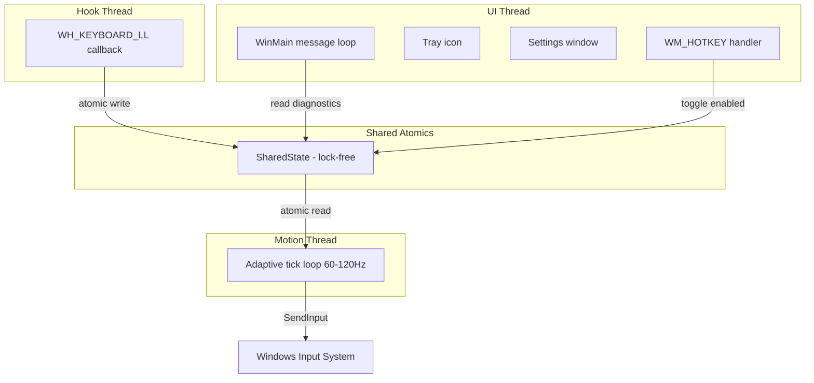

# CursorMove — Implementation Walkthrough

## Summary

Built a **production-grade Win32 keyboard-to-cursor controller** in C++14 using MinGW g++ 6.3.0. The final exe is **2.3MB**, statically linked, with zero external runtime dependencies.

## Architecture



## Files Created

| File | Purpose | Lines |
|------|---------|-------|
| `build.bat` | One-click build (release/debug) | ~90 |
| `res/resource.h` | Resource IDs | 17 |
| `res/resource.rc` | Manifest embedding | 4 |
| `res/app.manifest` | DPI awareness + Common Controls v6 | 22 |
| `src/types.h` | Enums, constants, MotionParams | 55 |
| `src/state.h` | Atomic SharedState struct | 65 |
| `src/util.h/cpp` | Error formatting, paths, helpers | ~80 |
| `src/keys.h/cpp` | VK code ↔ name mapping (~90 keys) | ~130 |
| `src/tray.h/cpp` | System tray icon + context menu | ~120 |
| `src/hook.h/cpp` | LL keyboard hook thread | ~200 |
| `src/motion.h/cpp` | Adaptive motion engine | ~290 |
| `src/config.h/cpp` | JSON config load/save/validate | ~220 |
| `src/hotkey.h/cpp` | Global hotkey registration | ~115 |
| `src/ui.h/cpp` | 4-tab settings window | ~330 |
| `src/main.cpp` | Entry point, orchestration | ~330 |
| `lib/json.hpp` | nlohmann/json (bundled) | — |

## Key Features Implemented

### Safety & Error Handling
- **Single-instance mutex** — prevents duplicate launches
- **Injected event filtering** — `LLKHF_INJECTED` check prevents feedback loops
- **SendInput failure tracking** — auto-disables after 50 consecutive failures
- **Config validation** — invalid/missing fields always fall back to safe defaults
- **Sleep/resume handling** — clears all states on `WM_POWERBROADCAST`
- **Session lock/unlock** — disables motion on lock via WTS notifications
- **Graceful degradation** — each subsystem failure is non-fatal
- **Every WinAPI call checked** — no unchecked return values

### Motion Engine
- **Time-based movement** — uses real `dt` from `QueryPerformanceCounter`
- **Cubic ease-out acceleration** — `1 - (1 - t)^3` curve
- **Frame-rate-independent smoothing** — separate accel/decel factors
- **Sub-pixel accumulator** — no jitter at low speeds
- **Adaptive tick rate** — 60→120 Hz self-adjusting
- **SleepEx-based timing** — never busy-spins
- **Precision mode** — hold LShift for 35% speed

### Controls
- **Toggle**: `Alt+S` (global hotkey)
- **Panic**: `Ctrl+Alt+Esc` (force-disable)
- **Movement**: WASD
- **Clicks**: Space (left), E (right), Q (middle)
- **Scroll**: R (up), F (down)
- **Precision**: LShift (hold)

### GUI
- System tray icon with context menu
- 4-tab settings window (General, Keys, Motion, Diagnostics)
- Slider-based parameter tuning with live preview
- Key remapping via capture dialog
- Live diagnostics (hook status, tick rate, error codes)

## How to Build

```bash
cd cursormove
build.bat          # Release build
build.bat debug    # Debug build
```

## How to Use

1. Run `CursorMove.exe` — tray icon appears
2. Press `Alt+S` to enable — tooltip changes to "Enabled"
3. Use WASD to move cursor, Space to click
4. Press `Alt+S` again to disable
5. `Ctrl+Alt+Esc` for emergency panic stop
6. Right-click tray → Settings to tune parameters
7. Right-click tray → Exit to close
